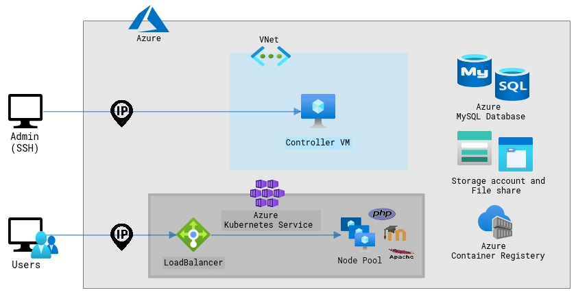
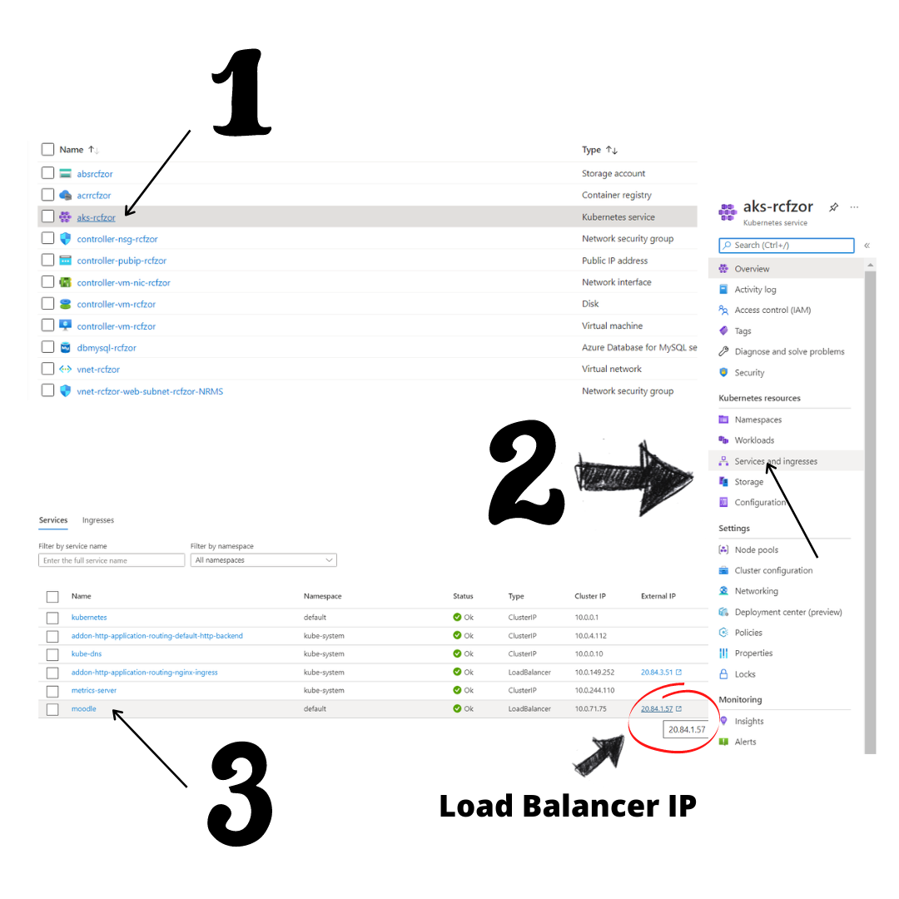

# Migrating Moodle to Container Environment in Azure

This repository contains [Azure Resource Manager](https://docs.microsoft.com/en-us/azure/azure-resource-manager/management/overview) templates, customised [Moodle container](https://github.com/neerajajaja/moodle-to-azure-aks/tree/master/moodle-image) image suited for migration requirements based on the [Bitnami Docker Image for Moodle](https://github.com/bitnami/bitnami-docker-moodle) and end to end scripts to automate the migration of the on-premises [Moodle](https://moodle.org/) App to container environment in Azure such as [Azure Kubernetes Services](https://azure.microsoft.com/en-in/services/kubernetes-service/). A step by step [guide](https://github.com/neerajajaja/moodle-to-azure-aks#prerequisites) to perform the migration using the provided scripts can also be found below.

Versions supported by this repository:
- **Moodle:** 3.8.x, 3.9.x, 3.10.x
- **PHP Version:** 7.2.x, 7.3.x, 7.4.x
- **Apache Version:** [2.4.41](https://github.com/neerajajaja/moodle-to-azure-aks/blob/master/moodle-arm-templates/scripts/install_moodle.sh#L234)
- **MySQL:** 5.6, 5.7, 8.0

## Infrastructure to Deploy in AKS
The templates in ```moodle-arm-templates``` deploys the below infrastructure:

- **Controller VM:** 
  -Builds the custom moodle image according to the PHP version and publishes it to Azure Container Registery. 
  - Further, it deploys the Moodle custom image using the Bitnami Helm chart.
- **Azure MySQL Database:** 
  - MySQL database on on-premises is exported to Azure database for MySQL at the Controller VM.
- **Azure Container Registery:** 
  - Container image required for our moodle migration is pushed and pulled from the Azure Container Registery.
- **Azure Kubernetes Services:** 
  - Useful to deploy and manage our Moodle application.
  - It creates required resources such as Load Balancer, Node Pools, Persistent volume claim and others required for running our Moodle container image.
- **Azure File Share:** 
  - On-prem data(moodle, moodledata, sqldump) is copied to Azure File Share and it is mounted to Controller VM for purpose of editing Moodle config.php files with new config details. 
  - Also, it serves as persistent volume for pods running the Moodle container image.

## Directory Structure
```
moodle-to-azure-aks
│ 
├── moodle-arm-templates          # contains arm templates and scripts to deploy the required infrastructure 
│   ├── aks                       # contains the volume yaml to be applied to aks
│   │   ├── pv.yaml               # persistent volume to be applied to aks(called at install_moodle.sh)
│   │   └── pvc.yaml              # persistent volume claim to be applied to aks(called at install_moodle.sh)
│   ├── scripts                   # contains script to install moodle at ctlr vm
│   │   └── install_moodle.sh     # imports sql db to azure my sql db, builds custom container image and pushes to acr and deploys moodle on kubernetes with bitnami helm chart
│   ├── nested                    # contains arm templates to create all required resources
│   │   ├── acr.json              # creates azure container registery that stores the image repository of custom moodle image
│   │   ├── aks.json              # creates required AKS resource
│   │   ├── controller-setup.json      # extension runs custom script install_moodle.sh in ctlr vm
│   │   ├── controller.json	      # creates controller vm along with the other required resources. Triggers controller-setup.json
│   │   ├── db-mysql.json         # creates Azure MySQL resource with required firewall rules
│   │   ├── network-subnet.json      # creates the network subnet in the vnet created in network.json
│   │   ├── network.json          # creates the network template including public ip for ctlr vm, required vnets and triggers subnet template
│   │   ├── storage-account.json     # creates storage account and afs(similar to storage-account.json)
│   │   └── vm-setup-params.json     # sets up the parameters to be injected into the controller vm
│   ├── azuredeploy.json          # main arm template that when triggered, deploys the intended infrastructure for moodle migration to aks by triggering templates in nested/
│   └── storagedeploy.json        # arm template that creates storage account along with azure file share
│
├── moodle-image                  # contains custom Moodle image which is used to build the container in install_moodle.sh script at controller vm
│   ├── prebuildfs                # prebuildfs folder
│   ├── rootfs                    # rootfs folder
│   ├── Dockerfile                # Dockerfile for custom Moodle image
│   └── README.md                 # documents the customisation of bitnami docker moodle image to suit our migration requirements
│
├── moodle-migration              # folder with end to end automation scripts
│   ├── scripts 		
│   │   ├── create-afs.sh         # deploys the template storagedeploy.json that creates storage account with Azure file share
│   │   ├── create-infra.sh       # deploys the main template azuredeploy.json
│   │   ├── dataMigrate.sh        # copies moodle, moodledata folders and sql dump to created azure file share
│   │   ├── dataMigrateHelper.sh     # helper functions for dataMigrate.sh
│   │   ├── discovery.sh          # performs configuration discovery of web server, php versions and other required config details
│   │   ├── discoveryHelper.sh       # helper functions for discovery.sh
│   │   ├── helper-functions.sh      # helper functions for moodle migration script
│   │   └── prepare-arm-params.sh	   # prepares parameters for arm templates for storage account creation with file share and main deployment json
│   └── migrate-moodle.sh         # the script that executes end to end automation
│
├── images                        # images folder
│   ├── loadbalancer_ip.png	      # instructions to get load balancer ip
│   └── infrastructure.png        # infrastructure deployed to Azure Kubernetes Service(AKS)
│   		 
└── README.md                     # README file for the repo

```

## Prerequisites
The script must be executed on the Virtual/Physical Machine hosting a Moodle web server. If there are multiple of them hosting web server behind a load balancer, the script should only be executed on one of the machines (you can choose any one of the machines). It is also important to ensure that there is only one moodle instance running on the webserver.

### 0. Enable Maintenance Mode
Set your moodle site in maintenance mode to ensure that data is preserved during the migration. 
An administrator can put the moodle site into maintenance mode through *Administration > Site administration > Server > Maintenance mode*. Refer this [link](https://docs.moodle.org/311/en/Maintenance_mode)


### 1. Commands Required
The following need to be available on the on-prem system before we can perform the migration:
```
tar
python3
mysqldump
locate
bc
```
Steps to install [locate](https://askubuntu.com/questions/215503/how-to-install-the-locate-command/215509#215509) and [bc](https://askubuntu.com/questions/550985/installing-bc-and-any-maths-extension).

### 2. Azure CLI Install and Login
- Additionally, we need to install [Azure CLI](https://docs.microsoft.com/en-us/cli/azure/what-is-azure-cli). The Azure CLI [installation guide](https://docs.microsoft.com/en-us/cli/azure/install-azure-cli-linux?pivots=apt) can be followed or you can simply run the command below:
```
curl -sL https://aka.ms/InstallAzureCLIDeb | sudo bash
```
- Login to Azure account which has permission to create resource group, resources in the subscription either interactively using ```az login``` or through the command line with ```az login -u <username> -p <password>```.

- Now, set default subscription with the command below while replacing ```<subscription>``` with the name of your intended default subscription:
```
az account set --subscription <subscription>
```

### 3. Set Necessary Permissions
Ensure that script executer has the following permissions. They can be set using ```chmod``` [command](https://linuxize.com/post/chmod-command-in-linux/):
 - **read permissions** for *moodledata* folder, *moodle* folder and its contents, *config.php* and *version.php* located in moodle folder. 
 - **execute permissions** for performing database dump on the moodle database.

## Step by Step Guide to Migrate to Azure
Firstly, this repository must be cloned
```
git clone https://github.com/neerajajaja/moodle-to-azure-aks.git
```
Ensure that ```./moodle-migration/migrate-moodle.sh``` and all the scripts in ```./moodle-migration/scripts``` has execute permissions.
```
chmod -R 755 moodle-migration
```
Execute ```./moodle-migration/migrate-moodle.sh``` script file. This will perform the end to end migration.
```
cd moodle-migration
bash migrate-moodle.sh
```
```migrate-moodle.sh``` takes the following self explainable inputs:
- Location of Azure resource group
- Name of Azure resource group

Status of Migration will be updated in the console till the deployment is completed successfully.

The script outputs the *Controller VM IP*, *ssh Username* and the *private and public ssh key files* for the controller vm. This can be used to ssh into the controller vm to perform administrative tasks.

The Loadbalancer IP after the migration is performed can be gotten as below:
- SSH into controller VM using the credentials and IP printed out as output
- Run the commands below to echo the loadbalancer IP:
  ```
  export SERVICE_IP=$(kubectl get svc --namespace default moodle --template "{{ range (index .status.loadBalancer.ingress 0) }}{{.}}{{ end }}")
  echo "Moodle(TM) URL: http://$SERVICE_IP/"
  ```
- Alternatively, the loadbalancer IP can be found from the Azure portal as well.
  1. Select the AKS resource after navigating to your resource group(this name would have been entered by you as input) in the specified subscription.
  2. Select Service and Ingress on the left
  3. The loadbalancer ip corresponding to moodle can then be found
  
